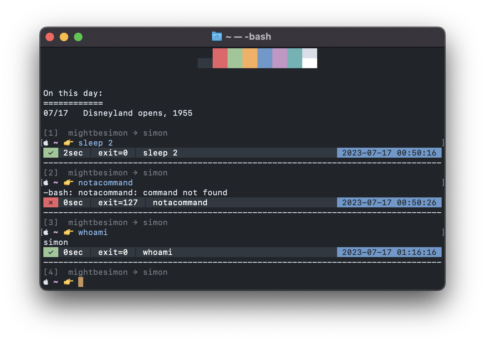

# profile.bash #

> \[!IMPORTANT]
> This project has no 'stable' release. If something doesn't work, then just read the error message and fix it.



## Compatibility ##

Should work with almost any version of macOS (12.7.6 and 26), Darwin (21.6.0), Debian (12 and 13), Ubuntu ()

Works with BSD (default) and GNU (compatible) coreutils

## Branches ##

use the `stash` branch for the most current features

all branches are unstable anyways so you might as well

## Optional dependencies ##

| dependency            | description |
|-----------------------|-------------|
| **`brew`**            | this project adds a considerable amount of quality of life improvements to `brew`
| **`eza`**             | colourful `ls`, `brew install eza`
| **`bat`**             | colourful `cat`, `brew install bat`
| **`bash-completion`** | `brew install bash-completion`

## Installation ##

```bash
curl -fsSL https://install.mightbesimon.com/profile.bash | bash
# just points to https://github.com/mightbesimon/profile.bash/install/install.bash
```

to pass a custom install path

```bash
curl -fsSL https://install.mightbesimon.com/profile.bash | bash \
--path ~/github/profile.bash \
--branch stash
```

## Uninstall ##

```bash
command rm -r $PROFILE
```

manual installation

```bash
# other options are
# /usr/local/profile.bash/			# system install, needs root permissions
# ~/.local/share/profile.bash/		# shared user local install, if each user needs different versions
# /opt/profile.bash/				# system install
install_ms=$(perl -MTime::HiRes=time -e "printf '%u', time*1000")
PROFILE=/usr/local/profile.bash/	# can use custom path
git clone -C $(dirname $PROFILE)
git -C $PROFILE checkout stash
echo export PROFILE=$PROFILE >> ~/.profile	# can use custom path
mkdir -p ~/.config/profile.bash
> ~/.config/profile.bash/config.bash
source ~/.profile
timer install_ms
log info profile.bash installation complete
# link .inputrc
ln -s $PROFILE/inputrc "$HOME/.inputrc"
# link configs
```

## Highlights ##

- Prompt with command duration, exit status, git branch, and virtualenv awareness (`prompt.bash`).
- Colour palette exports and background helpers for scripts (`colour.bash`).
- Quality-of-life aliases for macOS, Python, Git, Node.js, and Homebrew workflows (`alias.bash`, `path.bash`).
- Handy functions, including `config` for editing dotfiles and the daily `onthisday` easter egg (`functions.bash`).

## Quick Start ##

```bash
PROFILE=~/github/profile.bash
git clone https://github.com/mightbesimon/profile.bash.git "$PROFILE"

# Optional: apply the matching terminal theme
open "$PROFILE/assets/Mariana.terminal" 2> /dev/null

# Silence the login message and source the profile
touch ~/.hushlogin
[ -f ~/.bash_profile ] || touch ~/.bash_profile
printf '\nexport PROFILE=%s\nsource "$PROFILE/profile.bash"\n' "$PROFILE" >> ~/.bash_profile
source ~/.bash_profile
```

That will reload your shell with the new prompt, colours, and aliases. Use a different `PROFILE` path if you prefer another location.

## Updating & Removal ##

- Pull the latest changes at any time with `update` (alias for `git -C $PROFILE pull`).
- To remove the profile, delete the clone and remove the `PROFILE` lines from `~/.bash_profile`. There is also an `install/uninstall.bash` script if you prefer an automated cleanup.

## Customising ##

- Edit `alias.bash` or `functions.bash` to add your own shortcuts.
- Adjust environment variables, default editors, or prompt pieces in `profile.bash` and `prompt.bash`.
- Add language-specific paths in `path.bash`; Homebrew and common IDEs are pre-configured.

## Repository Layout ##

```
profile.bash/           Main entry point sourced from your shell
alias.bash              Aliases and shell helpers
colour.bash             ANSI colour exports
compile.bash            Optional compile/run helpers for C/Java/OpenGL
functions.bash          Utility functions (`config`, `onthisday`, etc.)
path.bash               PATH and Homebrew environment setup
prompt.bash             Prompt rendering and timing hooks
install/                Simple install/uninstall scripts
assets/                 Screenshot, terminal theme, colour notes
```

Enjoy the prompt! PRs and tweaks welcome.
